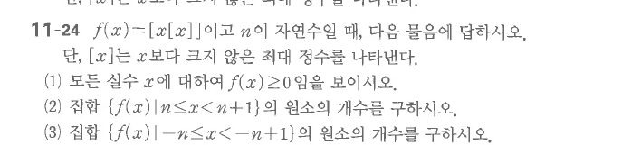

# 연습문제 11-24

## 문제

$f(x)=[x[x]]$이고 $n$이 자연수일 때, 다음 물음에 답하시오. 단, $[x]$는 $x$보다 크지 않은 최대 정수를 나타낸다.

1. 모든 실수 $x$에 대하여 $f(x)\ge0$임을 보이시오.
2. 집합 $\{f(x)\mid n\le x<n+1\}$의 원소의 개수를 구하시오.
3. 집합 $\{f(x)\mid -n\le x<-n+1\}$의 원소의 개수를 구하시오.

## 원문

