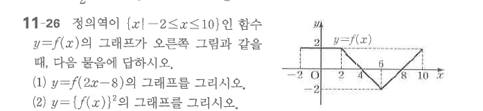

# 연습문제 11-26

## 문제

정의역이 $\{x\mid -2\le x\le10\}$인 함수 $y=f(x)$의 그래프가 오른쪽 그림과 같을 때, 다음 물음에 답하시오.

1. $y=f(2x-8)$의 그래프를 그리시오.
2. $y=\{f(x)\}^2$의 그래프를 그리시오.

## 도형

원래 그래프는 $[-2,0]$에서 $y=2$인 수평선, $[0,4]$에서 $2$에서 $0$으로 감소하는 선분, $[4,6]$에서 $0$에서 $-2$로 감소하는 선분, $[6,10]$에서 $-2$에서 $2$로 증가하는 선분으로 이루어진다.

## 원문

