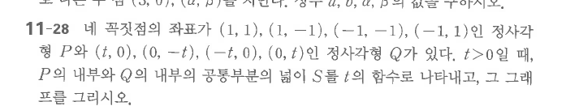

# 연습문제 11-28

## 문제

네 꼭짓점의 좌표가 $(1,1)$, $(1,-1)$, $(-1,-1)$, $(-1,1)$인 정사각형 $P$와 $(t,0)$, $(0,-t)$, $(-t,0)$, $(0,t)$인 정사각형 $Q$가 있다. $t>0$일 때, $P$의 내부와 $Q$의 내부의 공통부분의 넓이 $S$를 $t$의 함수로 나타내고, 그 그래프를 그리시오.

## 원문

