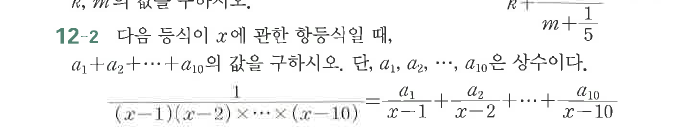

# 연습문제 12-2

## 문제

다음 등식이 $x$에 관한 항등식일 때, $a_1+a_2+\cdots+a_{10}$의 값을 구하시오. 단, $a_1,a_2,\ldots,a_{10}$은 상수이다.
$$
\frac1{(x-1)(x-2)\cdots(x-10)}=\frac{a_1}{x-1}+\frac{a_2}{x-2}+\cdots+\frac{a_{10}}{x-10}
$$

## 원문

