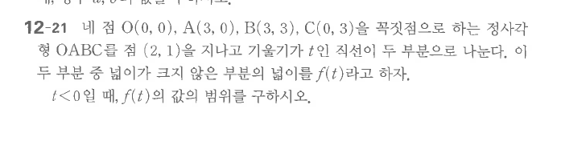

# 연습문제 12-21

## 문제

네 점 $O(0,0)$, $A(3,0)$, $B(3,3)$, $C(0,3)$을 꼭짓점으로 하는 정사각형 $OABC$를 점 $(2,1)$을 지나고 기울기가 $t$인 직선이 두 부분으로 나눈다. 이 두 부분 중 넓이가 크지 않은 부분의 넓이를 $f(t)$라고 하자. $t<0$일 때, $f(t)$의 값의 범위를 구하시오.

## 원문

