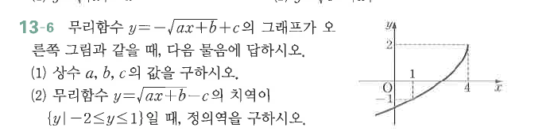
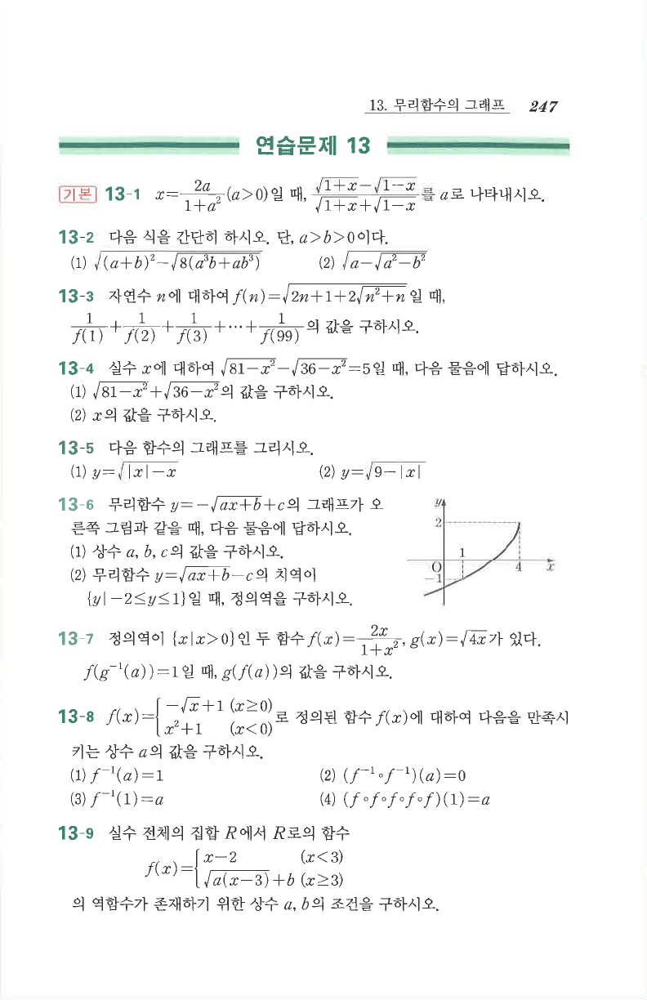

# 연습문제 13-6

## 문제

무리함수 $y=-\sqrt{ax+b}+c$의 그래프가 오른쪽 그림과 같을 때, 다음 물음에 답하시오.

1. 상수 $a$, $b$, $c$의 값을 구하시오.
2. 무리함수 $y=\sqrt{ax+b}-c$의 치역이 $\{y\mid -2\le y\le1\}$일 때, 정의역을 구하시오.

## 정답

1. $a=-\dfrac94$, $b=9$, $c=2$
2. $\{x\mid0\le x\le4\}$

## 도형

그래프는 끝점 $(4,2)$에서 시작해 왼쪽 아래로 뻗고, $y$축과 $(0,-1)$에서 만나는 형태이다.

## 원문

