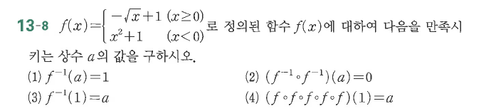

# 연습문제 13-8

## 문제

$$
f(x)=\begin{cases}
\sqrt{x}+1 & (x\ge0)\\
x^2+1 & (x<0)
\end{cases}
$$
로 정의된 함수 $f(x)$에 대하여 다음을 만족시키는 상수 $a$의 값을 구하시오.

1. $f^{-1}(a)=1$
2. $(f^{-1}\circ f^{-1})(a)=0$
3. $f^{-1}(1)=a$
4. $(f\circ f\circ f\circ f)(1)=a$

## 원문

