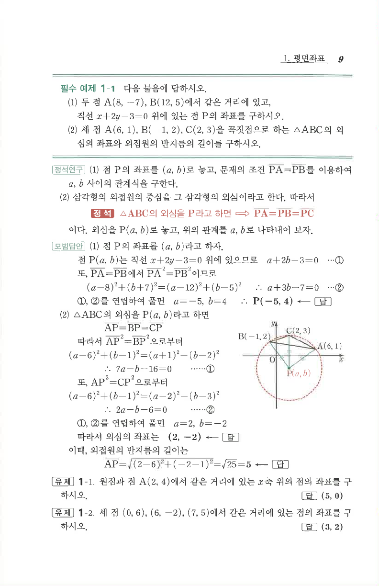

# 필수 예제 1-1

## 문제

다음 물음에 답하시오.

1. 두 점 $A(8,-7), B(12,5)$에서 같은 거리에 있고, 직선 $x+2y-3=0$ 위에 있는 점 $P$의 좌표를 구하시오.
2. 세 점 $A(6,1), B(-1,2), C(2,3)$을 꼭짓점으로 하는 $\triangle ABC$의 외심의 좌표와 외접원의 반지름의 길이를 구하시오.

## 정답

1. $P(-5,4)$
2. 외심 $(2,-2)$, 반지름 $5$

## 원문 문제

## 원문

