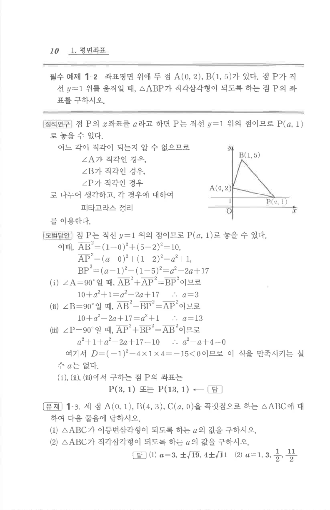

# 필수 예제 1-2

## 문제

좌표평면 위에 두 점 $A(0,2), B(1,5)$가 있다. 점 $P$가 직선 $y=1$ 위를 움직일 때, $\triangle ABP$가 직각삼각형이 되도록 하는 점 $P$의 좌표를 구하시오.

## 정답

$P(3,1)$ 또는 $P(13,1)$

## 도형

점 $P$는 수평선 $y=1$ 위에 있고, $A(0,2)$와 $B(1,5)$가 위쪽에 있어 세 점이 삼각형을 이룬다.

## 원문 문제

## 원문

