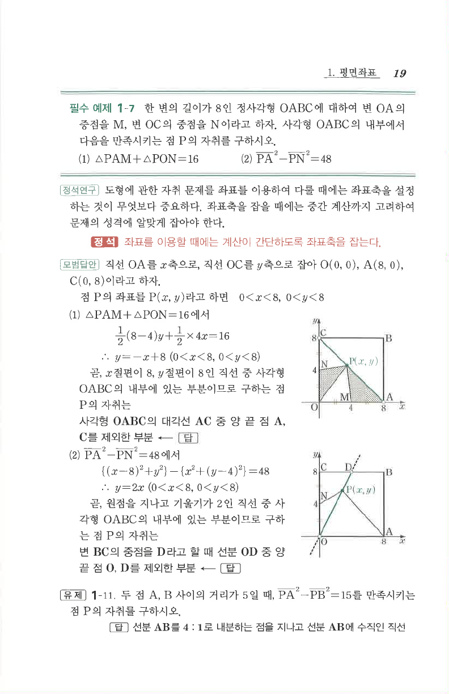

# 필수 예제 1-7

## 문제

한 변의 길이가 $8$인 정사각형 $OABC$에 대하여 변 $OA$의 중점을 $M$, 변 $OC$의 중점을 $N$이라고 하자. 사각형 $OABC$의 내부에서 다음을 만족시키는 점 $P$의 자취를 구하시오.

1. $\triangle PAM+\triangle PON=16$
2. $\overline{PA}^{2}-\overline{PN}^{2}=48$

## 정답

1. 정사각형 $OABC$의 대각선 $AC$ 중 양 끝 점 $A,C$를 제외한 부분
2. 변 $BC$의 중점을 $D$라고 할 때, 선분 $OD$ 중 양 끝 점 $O,D$를 제외한 부분

## 도형

정사각형을 $O(0,0), A(8,0), B(8,8), C(0,8)$로 두고, $M(4,0)$, $N(0,4)$를 사용한다.

## 원문 문제

## 원문

