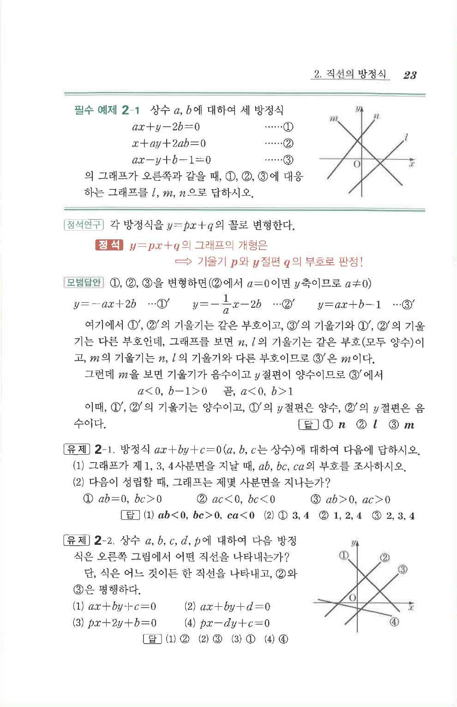

# 필수 예제 2-1

## 문제

상수 $a,b$에 대하여 세 방정식

$$
ax+y-2b=0 \qquad \cdots\text{①}
$$

$$
x+ay+2ab=0 \qquad \cdots\text{②}
$$

$$
ax-y+b-1=0 \qquad \cdots\text{③}
$$

의 그래프가 오른쪽과 같을 때, ①, ②, ③에 대응하는 그래프를 $l,m,n$으로 답하시오.

## 정답

① $n$, ② $l$, ③ $m$

## 도형

그림에는 세 직선 $l,m,n$이 있다. $l,n$은 양의 기울기이고, $m$은 음의 기울기이다. $n$은 양의 $y$절편, $l$은 음의 $y$절편을 가지며, $m$은 양의 $y$절편을 갖는다.

## 원문 문제

## 원문

