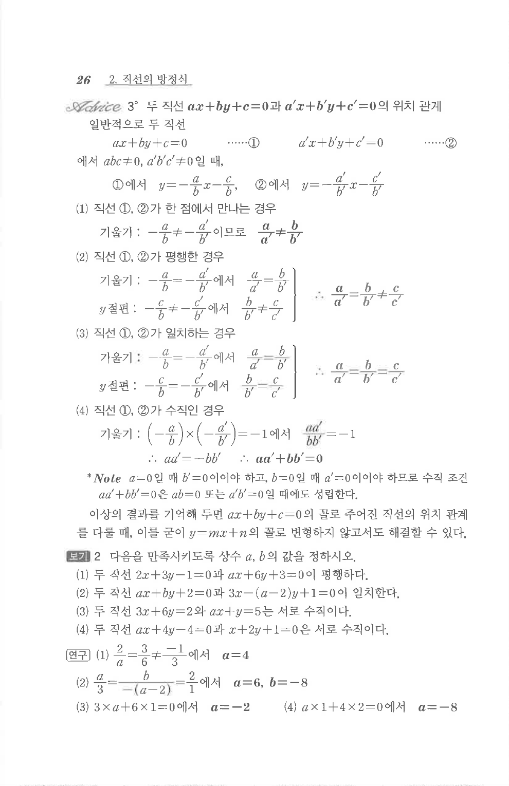

# S 보기 2

## 문제

다음을 만족시키도록 상수 $a,b$의 값을 정하시오.

1. 두 직선 $2x+3y-1=0$과 $ax+6y+3=0$이 평행하다.
2. 두 직선 $ax+by+2=0$과 $3x-(a-2)y+1=0$이 일치한다.
3. 두 직선 $3x+6y=2$와 $ax+y=5$는 서로 수직이다.
4. 두 직선 $ax+4y-4=0$과 $x+2y+1=0$은 서로 수직이다.

## 정답

1. $a=4$  
2. $a=6,\ b=-8$  
3. $a=-2$  
4. $a=-8$

## 원문 문제

## 원문

