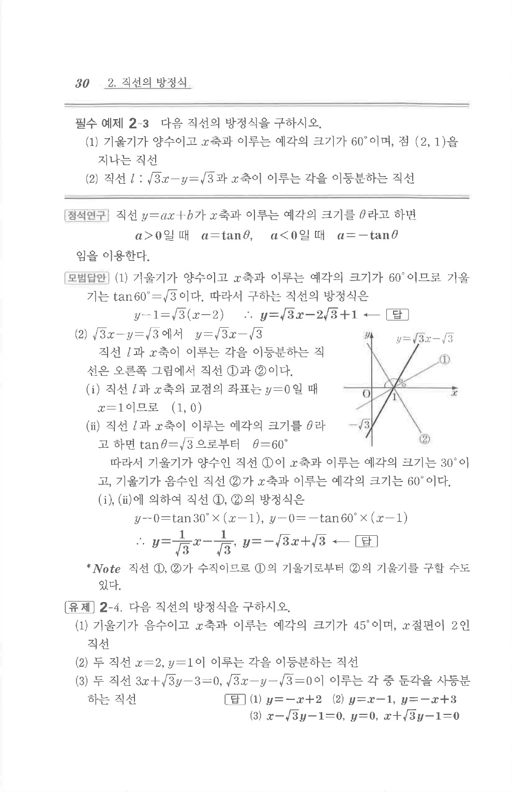

# 필수 예제 2-3

## 문제

다음 직선의 방정식을 구하시오.

1. 기울기가 양수이고 $x$축과 이루는 예각의 크기가 $60^\circ$이며, 점 $(2,1)$을 지나는 직선
2. 직선 $l:\sqrt3x-y=\sqrt3$과 $x$축이 이루는 각을 이등분하는 직선

## 정답

1. $y=\sqrt3x-2\sqrt3+1$  
2. $x-\sqrt3y-1=0$, $\sqrt3x+y-\sqrt3=0$

## 도형

두 번째 문항의 그림은 직선 $l$이 $x$축과 점 $(1,0)$에서 만나고, 이 각을 나누는 두 직선이 모두 $(1,0)$을 지나는 형태이다.

## 원문 문제

## 원문

