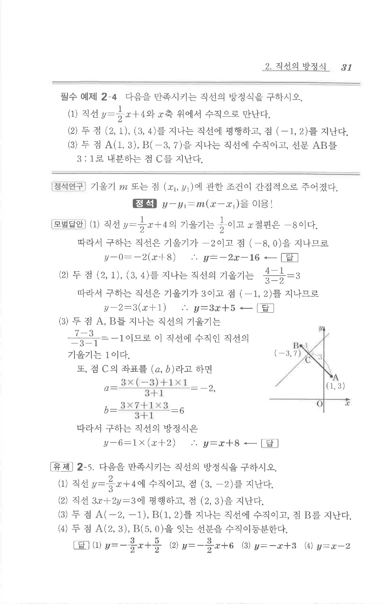

# 필수 예제 2-4

## 문제

다음을 만족시키는 직선의 방정식을 구하시오.

1. 직선 $y=\dfrac12x+4$와 $x$축 위에서 수직으로 만난다.
2. 두 점 $(2,1),(3,4)$를 지나는 직선에 평행하고, 점 $(-1,2)$를 지난다.
3. 두 점 $A(1,3), B(-3,7)$을 지나는 직선에 수직이고, 선분 $AB$를 $3:1$로 내분하는 점 $C$를 지난다.

## 정답

1. $y=-2x-16$  
2. $y=3x+5$  
3. $y=x+8$

## 원문 문제

## 원문

