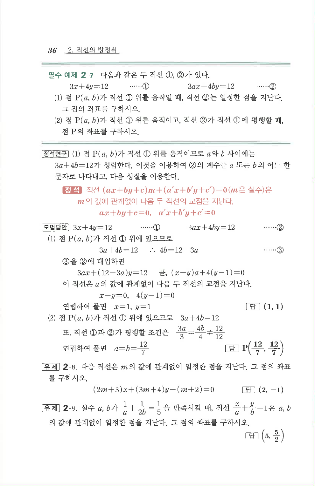

# 필수 예제 2-7

## 문제

다음과 같은 두 직선 ①, ②가 있다.

$$
3x+4y=12 \qquad \cdots\text{①}
$$

$$
3ax+4by=12 \qquad \cdots\text{②}
$$

1. 점 $P(a,b)$가 직선 ① 위를 움직일 때, 직선 ②는 일정한 점을 지난다. 그 점의 좌표를 구하시오.
2. 점 $P(a,b)$가 직선 ① 위를 움직이고, 직선 ②가 직선 ①에 평행할 때, 점 $P$의 좌표를 구하시오.

## 정답

1. $(1,1)$  
2. $P\left(\dfrac{12}{7},\dfrac{12}{7}\right)$

## 원문 문제

## 원문

