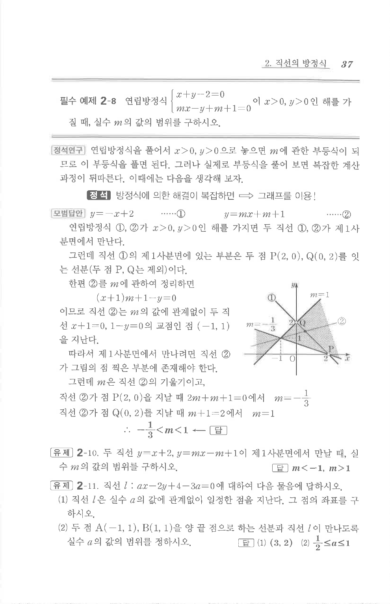

# 필수 예제 2-8

## 문제

연립방정식

$$
\begin{cases}
x+y-2=0,\\
mx-y+m+1=0
\end{cases}
$$

이 $x>0, y>0$인 해를 가질 때, 실수 $m$의 값의 범위를 구하시오.

## 정답

$-\dfrac13<m<1$

## 도형

두 직선의 교점이 제1사분면 안에 있어야 한다. 첫 번째 직선 $x+y-2=0$의 제1사분면 부분은 점 $(2,0)$과 $(0,2)$를 잇는 열린 선분이다.

## 원문 문제

## 원문

