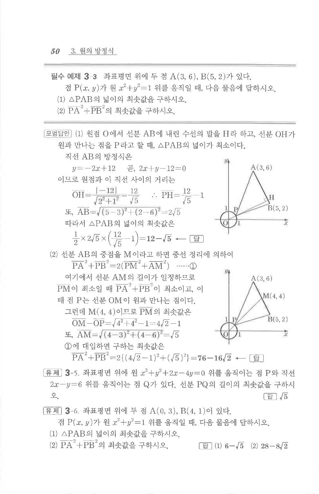

# 필수 예제 3-3

## 문제

좌표평면 위에 두 점 $A(3,6)$, $B(5,2)$가 있다. 점 $P(x,y)$가 원 $x^2+y^2=1$ 위를 움직일 때, 다음 물음에 답하시오.

1. $\triangle PAB$의 넓이의 최솟값을 구하시오.
2. $PA^2+PB^2$의 최솟값을 구하시오.

## 정답

1. $12-\sqrt5$  
2. $76-16\sqrt2$

## 도형

점 $P$가 단위원 위를 움직이고, 선분 $AB$와 원점에서 내린 수선 및 선분 $AB$의 중점이 이용되는 그림이다.

## 원문 문제

## 원문

