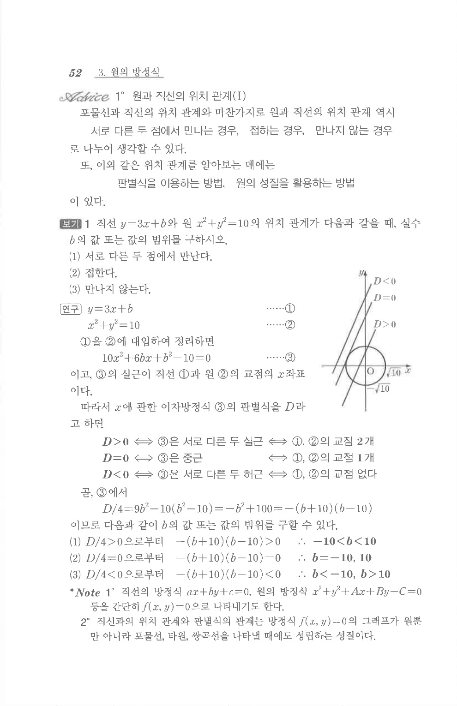

# S 보기 1

## 문제

직선 $y=3x+b$와 원 $x^2+y^2=10$의 위치 관계가 다음과 같을 때, 실수 $b$의 값 또는 값의 범위를 구하시오.

1. 서로 다른 두 점에서 만난다.
2. 접한다.
3. 만나지 않는다.

## 정답

1. $-10<b<10$  
2. $b=-10$ 또는 $b=10$  
3. $b<-10$ 또는 $b>10$

## 도형

오른쪽 그림은 판별식 $D$의 부호에 따라 직선이 원과 두 점에서 만나거나, 접하거나, 만나지 않는 세 경우를 나타낸다.

## 원문 문제

## 원문

