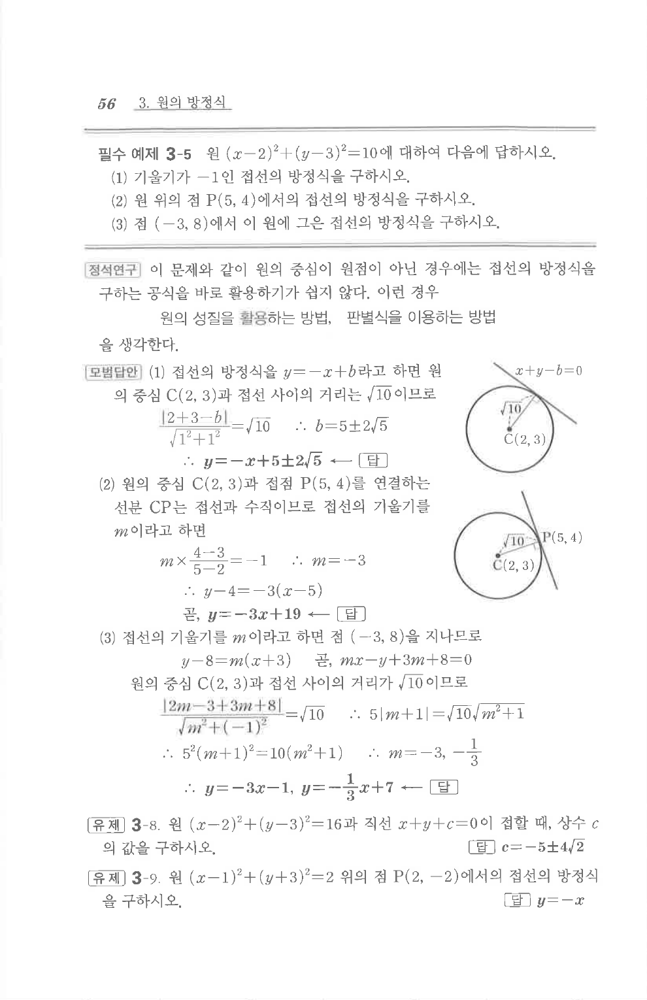

# 필수 예제 3-5

## 문제

원 $(x-2)^2+(y-3)^2=10$에 대하여 다음에 답하시오.

1. 기울기가 $-1$인 접선의 방정식을 구하시오.
2. 원 위의 점 $P(5,4)$에서의 접선의 방정식을 구하시오.
3. 점 $(-3,8)$에서 이 원에 그은 접선의 방정식을 구하시오.

## 정답

1. $y=-x+5\pm2\sqrt5$  
2. $y=-3x+19$  
3. $y=-3x-1$, $y=-\dfrac13x+7$

## 원문 문제

## 원문

