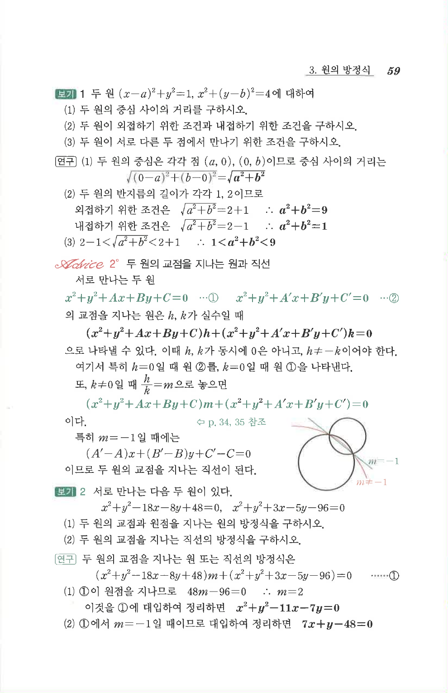

# S 보기 2

## 문제

서로 만나는 다음 두 원이 있다.

$$
x^2+y^2-18x-8y+48=0,
$$

$$
x^2+y^2+3x-5y-96=0.
$$

1. 두 원의 교점과 원점을 지나는 원의 방정식을 구하시오.
2. 두 원의 교점을 지나는 직선의 방정식을 구하시오.

## 정답

1. $x^2+y^2-11x-7y=0$  
2. $7x+y-48=0$

## 원문 문제

## 원문

