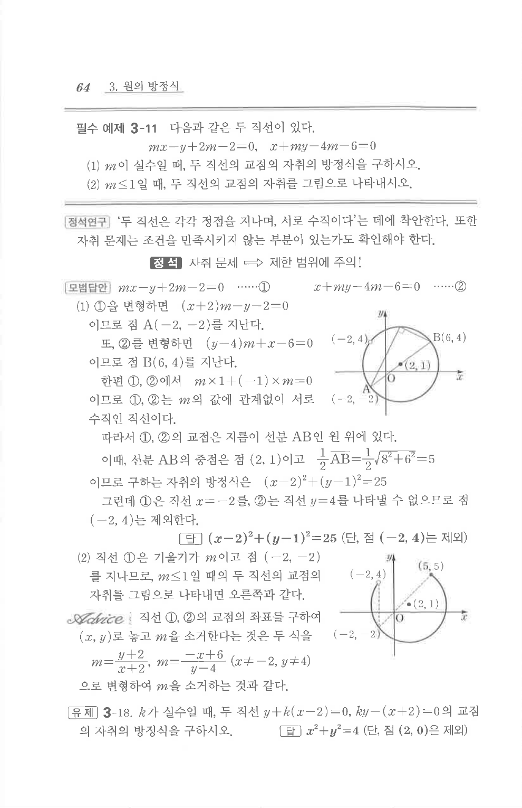

# 필수 예제 3-11

## 문제

다음과 같은 두 직선이 있다.

$$
mx-y+2m-2=0,
$$

$$
x+my-4m-6=0.
$$

1. $m$이 실수일 때, 두 직선의 교점의 자취의 방정식을 구하시오.
2. $m\le1$일 때, 두 직선의 교점의 자취를 그림으로 나타내시오.

## 정답

1. $(x-2)^2+(y-1)^2=25$ (단, 점 $(-2,4)$는 제외)

## 도형

두 직선은 각각 고정점 $(-2,-2)$, $(6,4)$를 지나며 서로 수직이다. 따라서 교점의 자취는 이 두 고정점을 지름의 양 끝점으로 하는 원 위에 놓인다. 두 번째 문항은 이 원에서 $m\le1$에 해당하는 부분을 표시하는 문제이다.

## 원문 문제

## 원문

