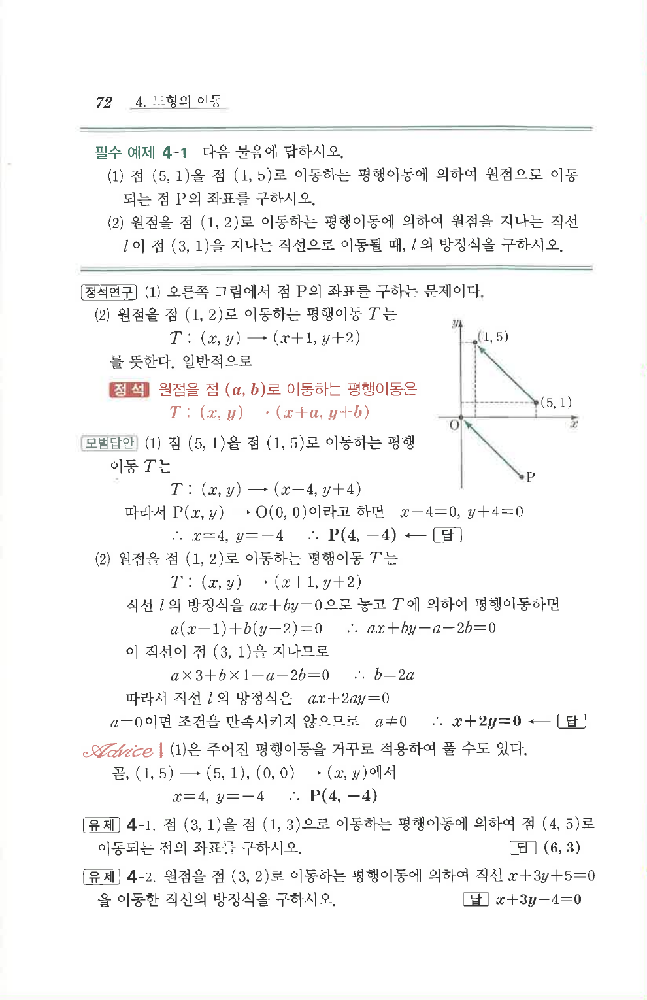

# 필수 예제 4-1

## 문제

다음 물음에 답하시오.

1. 점 $(5,1)$을 점 $(1,5)$로 이동하는 평행이동에 의하여 원점으로 이동되는 점 $P$의 좌표를 구하시오.
2. 원점을 점 $(1,2)$로 이동하는 평행이동에 의하여 원점을 지나는 직선 $l$이 점 $(3,1)$을 지나는 직선으로 이동될 때, $l$의 방정식을 구하시오.

## 정답

1. $P(4,-4)$  
2. $x+2y=0$

## 원문 문제

## 원문

