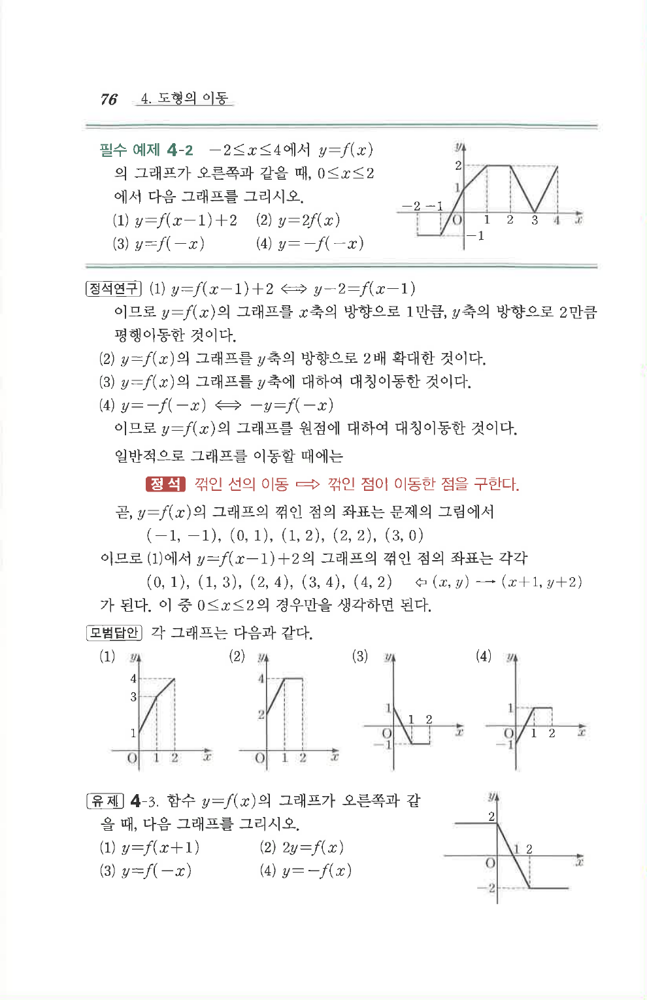

# 필수 예제 4-2

## 문제

$-2\le x\le4$에서 $y=f(x)$의 그래프가 오른쪽과 같을 때, $0\le x\le2$에서 다음 그래프를 그리시오.

1. $y=f(x-1)+2$
2. $y=2f(x)$
3. $y=f(-x)$
4. $y=-f(-x)$

## 도형

원문 그림의 $y=f(x)$ 그래프는 꺾인 선 형태이다. 주요 꺾인 점은 $(-1,1)$, $(0,1)$, $(1,2)$, $(2,2)$, $(3,0)$로 읽힌다. 각 문항은 평행이동, $y$축 방향 확대, $y$축 대칭, 원점 대칭을 적용한 뒤 $0\le x\le2$ 구간만 그리는 문제이다.

## 원문 문제

## 원문

