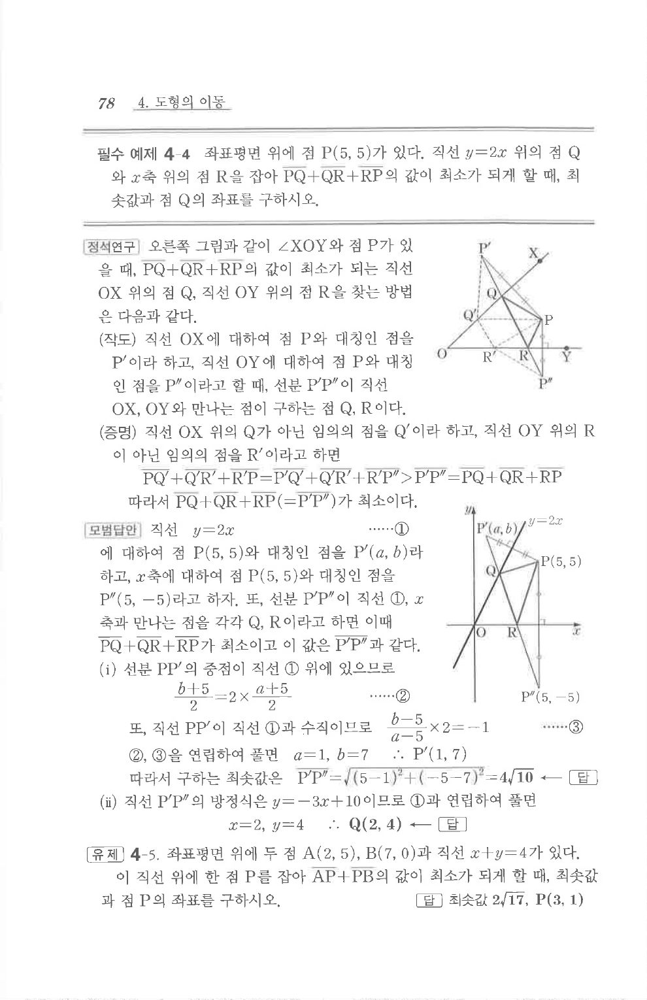

# 필수 예제 4-4

## 문제

좌표평면 위에 점 $P(5,5)$가 있다. 직선 $y=2x$ 위의 점 $Q$와 $x$축 위의 점 $R$을 잡아 $PQ+QR+RP$의 값이 최소가 되게 할 때, 최솟값과 점 $Q$의 좌표를 구하시오.

## 정답

최솟값 $4\sqrt{10}$, $Q(2,4)$

## 도형

점 $P$를 직선 $y=2x$와 $x$축에 각각 대칭이동한 점을 이용해 최단 경로를 만드는 그림이다.

## 원문 문제

## 원문

