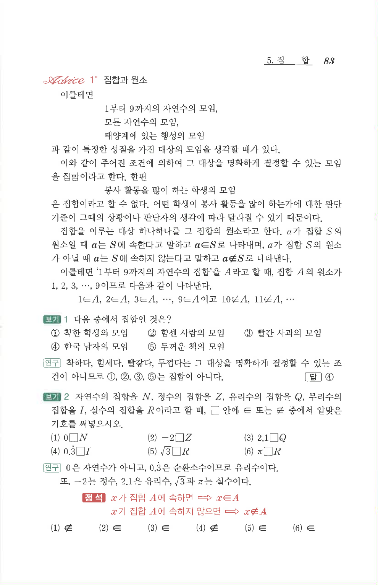

# S 보기 2

## 문제

자연수의 집합을 $N$, 정수의 집합을 $Z$, 유리수의 집합을 $Q$, 무리수의 집합을 $I$, 실수의 집합을 $R$이라고 할 때, $\square$ 안에 $\in$ 또는 $\notin$ 중에서 알맞은 기호를 써넣으시오.

1. $0\ \square\ N$
2. $-2\ \square\ Z$
3. $2.1\ \square\ Q$
4. $0.\dot{3}\ \square\ I$
5. $\sqrt3\ \square\ R$
6. $\pi\ \square\ R$

## 정답

1. $\notin$
2. $\in$
3. $\in$
4. $\notin$
5. $\in$
6. $\in$

## 원문 문제

## 원문

