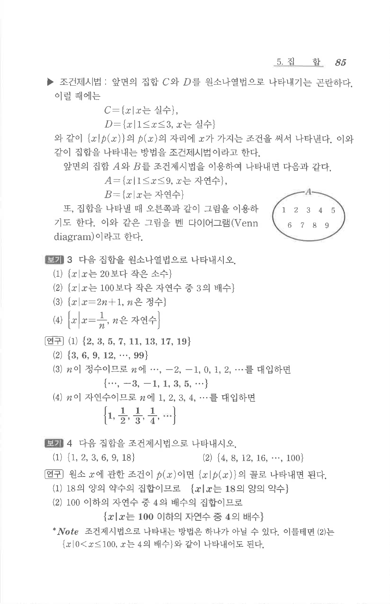

# S 보기 4

## 문제

다음 집합을 조건제시법으로 나타내시오.

1. $\{1,2,3,6,9,18\}$
2. $\{4,8,12,16,\cdots,100\}$

## 정답

1. $\{x\mid x\text{는 }18\text{의 양의 약수}\}$
2. $\{x\mid x\text{는 }100\text{ 이하의 }4\text{의 양의 배수}\}$

## 원문 문제

## 원문

