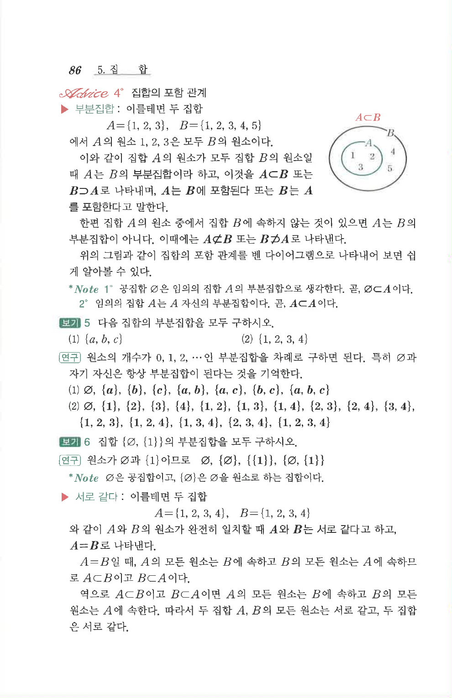

# S 보기 5

## 문제

다음 집합의 부분집합을 모두 구하시오.

1. $\{a,b,c\}$
2. $\{1,2,3,4\}$

## 정답

1. $\varnothing$, $\{a\}$, $\{b\}$, $\{c\}$, $\{a,b\}$, $\{b,c\}$, $\{c,a\}$, $\{a,b,c\}$
2. $\varnothing$, $\{1\}$, $\{2\}$, $\{3\}$, $\{4\}$, $\{1,2\}$, $\{1,3\}$, $\{1,4\}$, $\{2,3\}$, $\{2,4\}$, $\{3,4\}$, $\{1,2,3\}$, $\{1,2,4\}$, $\{1,3,4\}$, $\{2,3,4\}$, $\{1,2,3,4\}$

## 원문 문제

## 원문

