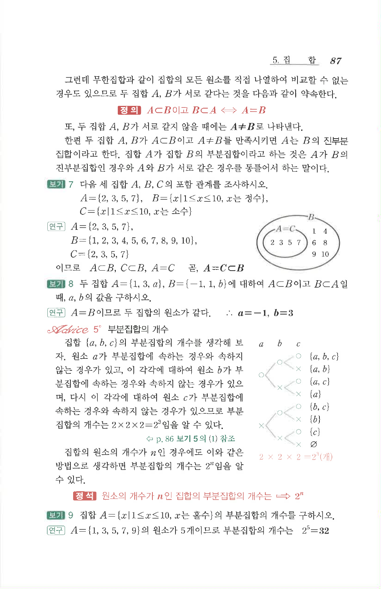

# S 보기 7

## 문제

다음 세 집합 $A$, $B$, $C$의 포함 관계를 조사하시오.

$A=\{2,3,5,7\}$, $B=\{x\mid 1\le x\le 10,\ x\text{는 정수}\}$, $C=\{x\mid 1\le x\le 10,\ x\text{는 소수}\}$

## 정답

$A=\{2,3,5,7\}$, $B=\{1,2,3,4,5,6,7,8,9,10\}$, $C=\{2,3,5,7\}$이므로 $A\subset B$, $C\subset B$, $A=C$이다. 곧 $A=C\subset B$.

## 도형

원문에는 $A=C$인 작은 타원이 집합 $B$ 안에 들어 있는 벤 다이어그램이 함께 제시되어 있다.

## 원문 문제

## 원문

