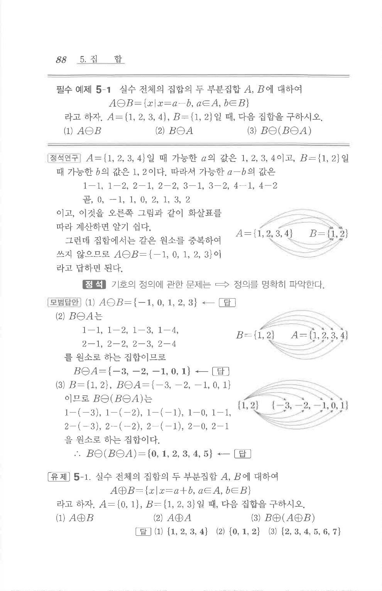

# 필수 예제 5-1

## 문제

실수 전체의 집합의 두 부분집합 $A$, $B$에 대하여

$$A\ominus B=\{x\mid x=a-b,\ a\in A,\ b\in B\}$$

라고 하자. $A=\{1,2,3,4\}$, $B=\{1,2\}$일 때, 다음 집합을 구하시오.

1. $A\ominus B$
2. $B\ominus A$
3. $B\ominus(B\ominus A)$

## 정답

1. $\{-1,0,1,2,3\}$
2. $\{-3,-2,-1,0,1\}$
3. $\{0,1,2,3,4,5\}$

## 원문 문제

## 원문

