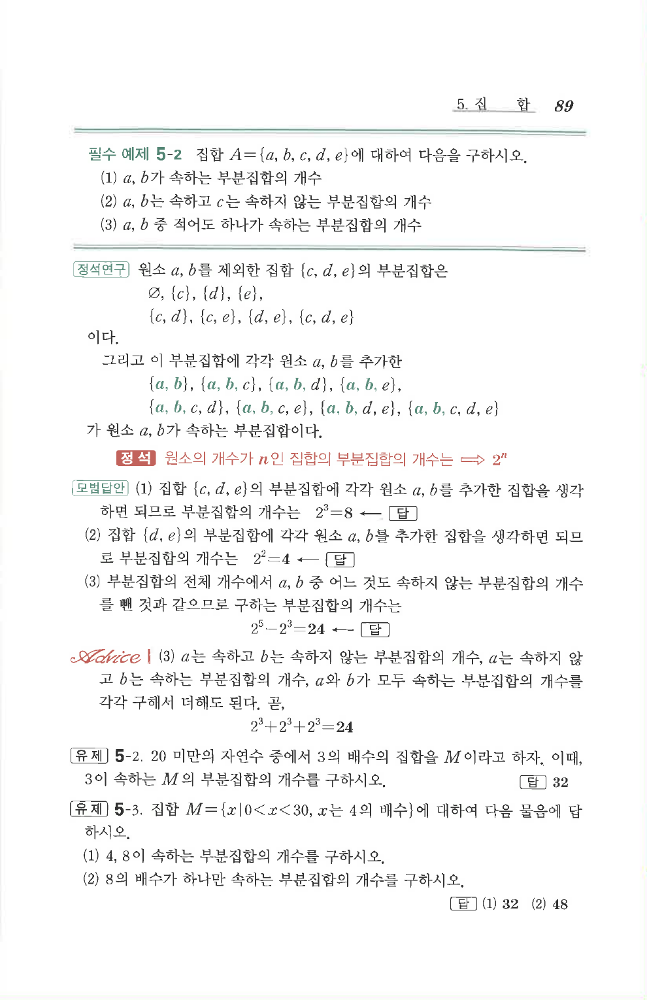

# 필수 예제 5-2

## 문제

집합 $A=\{a,b,c,d,e\}$에 대하여 다음을 구하시오.

1. $a$, $b$가 속하는 부분집합의 개수
2. $a$, $b$는 속하고 $c$는 속하지 않는 부분집합의 개수
3. $a$, $b$ 중 적어도 하나가 속하는 부분집합의 개수

## 정답

1. $8$
2. $4$
3. $24$

## 원문 문제

## 원문

