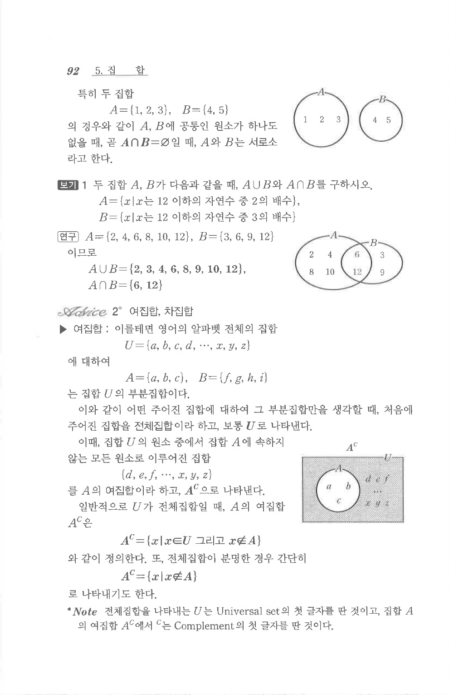

# S 보기 1

## 문제

두 집합 $A$, $B$가 다음과 같을 때, $A\cup B$와 $A\cap B$를 구하시오.

$A=\{x\mid x\text{는 }12\text{ 이하의 자연수 중 }2\text{의 배수}\}$

$B=\{x\mid x\text{는 }12\text{ 이하의 자연수 중 }3\text{의 배수}\}$

## 정답

$A=\{2,4,6,8,10,12\}$, $B=\{3,6,9,12\}$이므로

$A\cup B=\{2,3,4,6,8,9,10,12\}$, $A\cap B=\{6,12\}$.

## 도형

원문에는 두 원으로 된 벤 다이어그램이 있으며, 겹친 부분에 $6,12$가 놓인다.

## 원문 문제

## 원문

