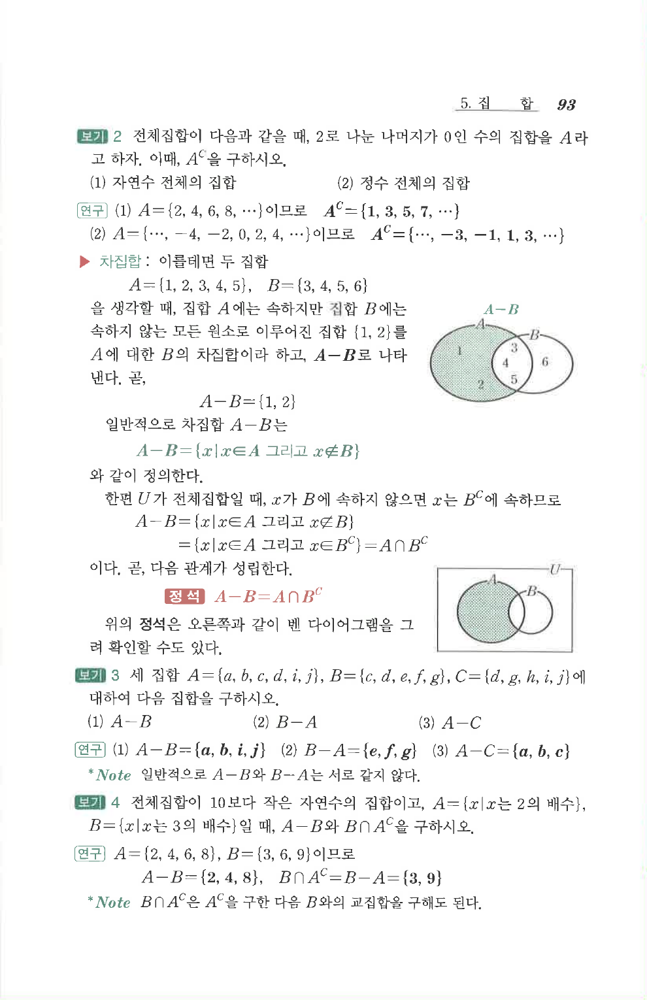

# S 보기 2

## 문제

전체집합이 다음과 같을 때, $2$로 나눈 나머지가 $0$인 수의 집합을 $A$라고 하자. 이때, $A^C$를 구하시오.

1. 자연수 전체의 집합
2. 정수 전체의 집합

## 정답

1. $A^C=\{1,3,5,7,\cdots\}$
2. $A^C=\{\cdots,-3,-1,1,3,\cdots\}$

## 원문 문제

## 원문

