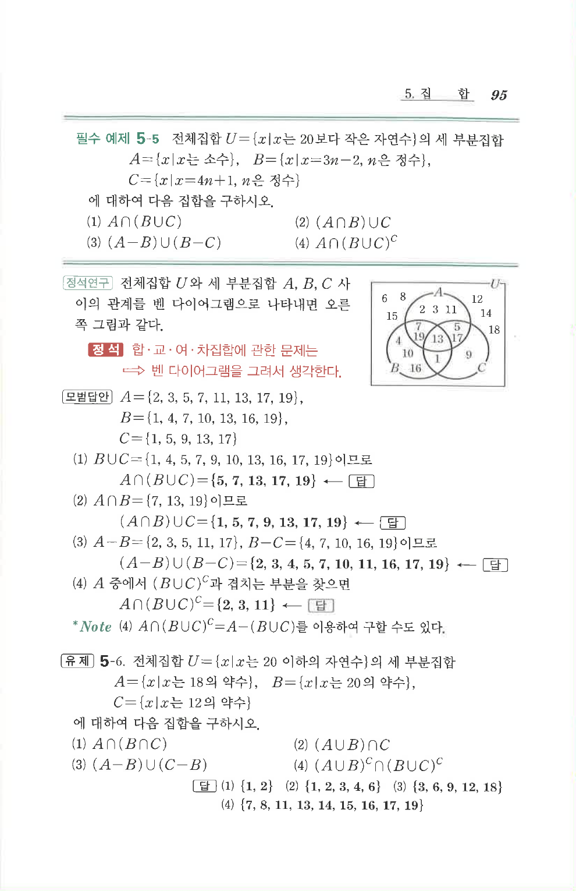

# 필수 예제 5-5

## 문제

전체집합 $U=\{x\mid x\text{는 }20\text{보다 작은 자연수}\}$의 세 부분집합

$A=\{x\mid x\text{는 소수}\}$, $B=\{x\mid x=3n-2,\ n\text{은 정수}\}$, $C=\{x\mid x=4n+1,\ n\text{은 정수}\}$

에 대하여 다음 집합을 구하시오.

1. $A\cap(B\cup C)$
2. $(A\cap B)\cup C$
3. $(A-B)\cup(B-C)$
4. $A\cap(B\cup C)^C$

## 정답

1. $\{5,7,13,17,19\}$
2. $\{1,5,7,9,13,17,19\}$
3. $\{2,3,4,5,7,10,11,16,17,19\}$
4. $\{2,3,11\}$

## 도형

원문 해설에는 전체집합 $U$ 안에 $A$, $B$, $C$ 세 집합의 벤 다이어그램이 함께 제시되어 있다.

## 원문 문제

## 원문

