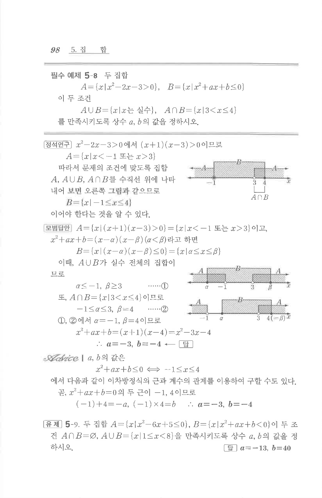

# 필수 예제 5-8

## 문제

두 집합

$A=\{x\mid x^2-2x-3>0\}$, $B=\{x\mid x^2+ax+b\le0\}$

이 두 조건

$$A\cup B=\{x\mid x\text{는 실수}\},\quad A\cap B=\{x\mid 3<x\le4\}$$

를 만족시키도록 상수 $a$, $b$의 값을 정하시오.

## 정답

$a=-3$, $b=-4$

## 도형

원문 해설에는 $A$, $B$, $A\cup B$, $A\cap B$의 관계를 수직선에 나타낸 그림이 있다.

## 원문 문제

## 원문

