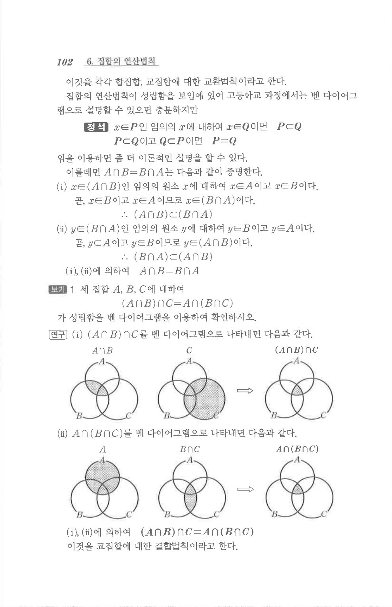

# S 보기 1

## 문제

세 집합 $A$, $B$, $C$에 대하여

$$(A\cap B)\cap C=A\cap(B\cap C)$$

가 성립함을 벤 다이어그램을 이용하여 확인하시오.

## 도형

원문에는 좌변과 우변을 각각 세 원의 벤 다이어그램으로 나타낸 그림이 있으며, 두 경우 모두 $A\cap B\cap C$ 부분만 남는다.

## 원문 문제

## 원문

