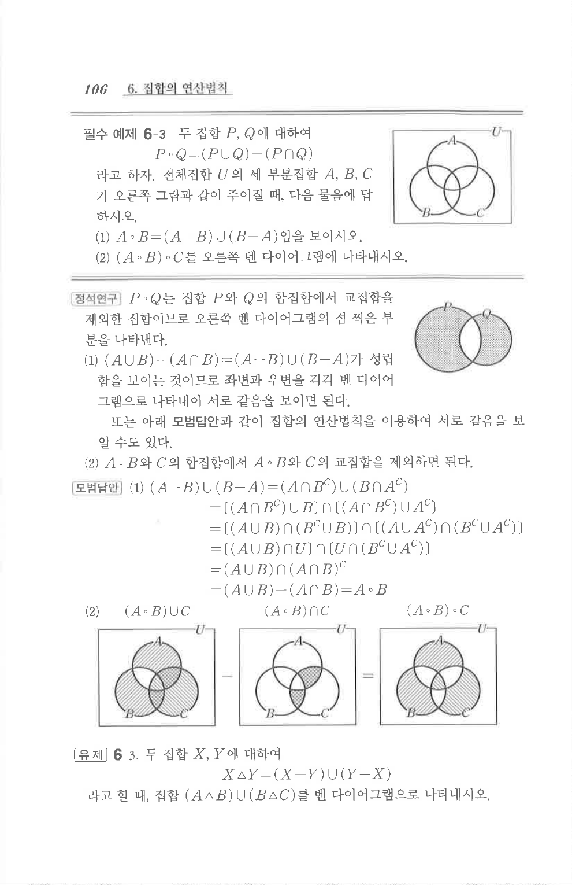

# 필수 예제 6-3

## 문제

두 집합 $P$, $Q$에 대하여

$$P\circ Q=(P\cup Q)-(P\cap Q)$$

라고 하자. 전체집합 $U$의 세 부분집합 $A$, $B$, $C$가 오른쪽 그림과 같이 주어질 때, 다음 물음에 답하시오.

1. $A\circ B=(A-B)\cup(B-A)$임을 보이시오.
2. $(A\circ B)\circ C$를 오른쪽 벤 다이어그램에 나타내시오.

## 도형

오른쪽 그림은 전체집합 $U$ 안에 세 원 $A$, $B$, $C$가 서로 겹치는 벤 다이어그램이다. $P\circ Q$는 두 집합의 합집합에서 교집합을 제외한 대칭차 영역을 뜻한다.

## 원문 문제

## 원문

