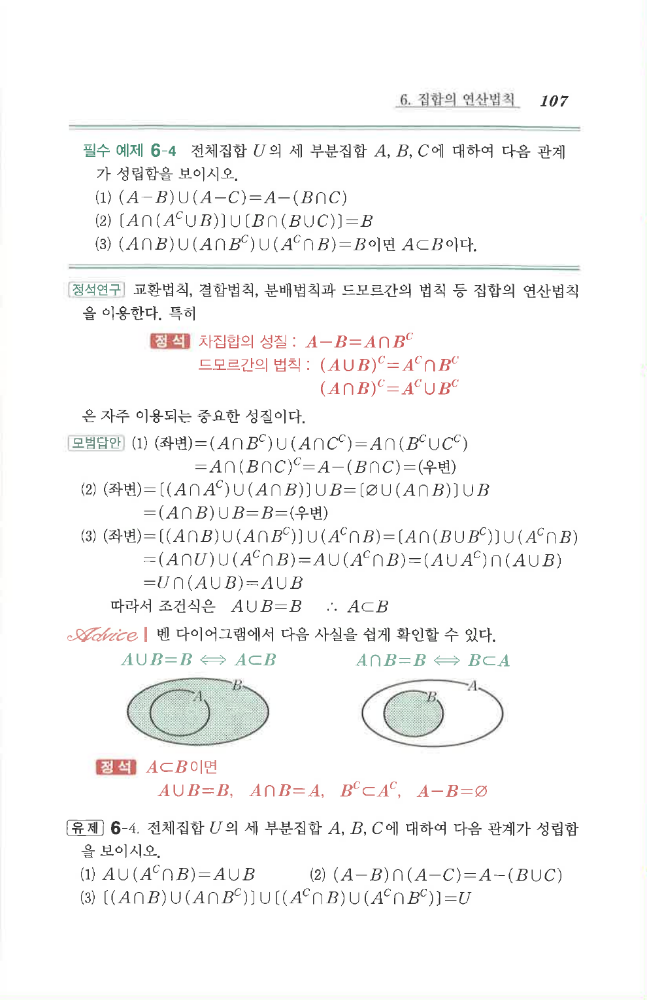

# 필수 예제 6-4

## 문제

전체집합 $U$의 세 부분집합 $A$, $B$, $C$에 대하여 다음 관계가 성립함을 보이시오.

1. $(A-B)\cup(A-C)=A-(B\cap C)$
2. $[A\cap(A^C\cup B)]\cup[B\cap(B\cup C)]=B$
3. $(A\cap B)\cup(A\cap B^C)\cup(A^C\cap B)=B$이면 $A\subset B$이다.

## 원문 문제

## 원문

