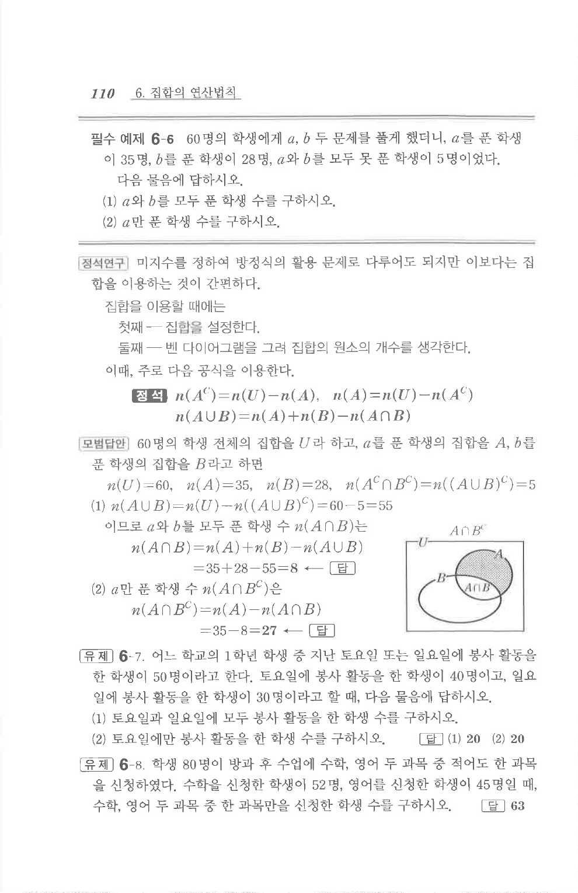

# 필수 예제 6-6

## 문제

$60$명의 학생에게 $a$, $b$ 두 문제를 풀게 했더니, $a$를 푼 학생이 $35$명, $b$를 푼 학생이 $28$명, $a$와 $b$를 모두 못 푼 학생이 $5$명이었다. 다음 물음에 답하시오.

1. $a$와 $b$를 모두 푼 학생 수를 구하시오.
2. $a$만 푼 학생 수를 구하시오.

## 정답

1. $8$
2. $27$

## 도형

원문 해설에는 $a$를 푼 학생 집합 $A$와 $b$를 푼 학생 집합 $B$를 겹친 두 원으로 나타낸 벤 다이어그램이 있다.

## 원문 문제

## 원문

