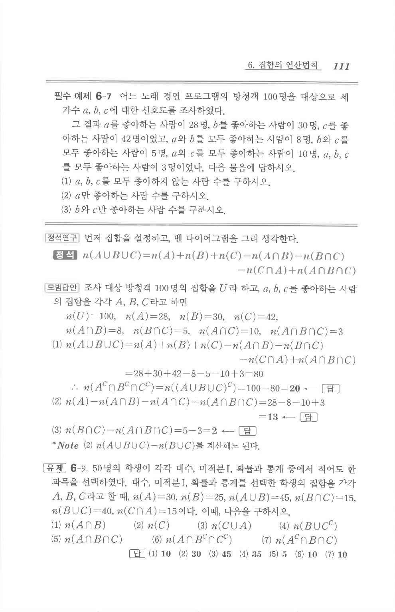

# 필수 예제 6-7

## 문제

어느 노래 경연 프로그램의 방청객 $100$명을 대상으로 세 가수 $a$, $b$, $c$에 대한 선호도를 조사하였다.

그 결과 $a$를 좋아하는 사람이 $28$명, $b$를 좋아하는 사람이 $30$명, $c$를 좋아하는 사람이 $42$명이었고, $a$와 $b$를 모두 좋아하는 사람이 $8$명, $b$와 $c$를 모두 좋아하는 사람이 $5$명, $a$와 $c$를 모두 좋아하는 사람이 $10$명, $a$, $b$, $c$를 모두 좋아하는 사람이 $3$명이었다. 다음 물음에 답하시오.

1. $a$, $b$, $c$를 모두 좋아하지 않는 사람 수를 구하시오.
2. $a$만 좋아하는 사람 수를 구하시오.
3. $b$와 $c$만 좋아하는 사람 수를 구하시오.

## 정답

1. $20$
2. $13$
3. $2$

## 도형

세 가수 $a$, $b$, $c$를 각각 세 집합으로 두고 세 원의 벤 다이어그램에 인원수를 채우는 문제이다.

## 원문 문제

## 원문

