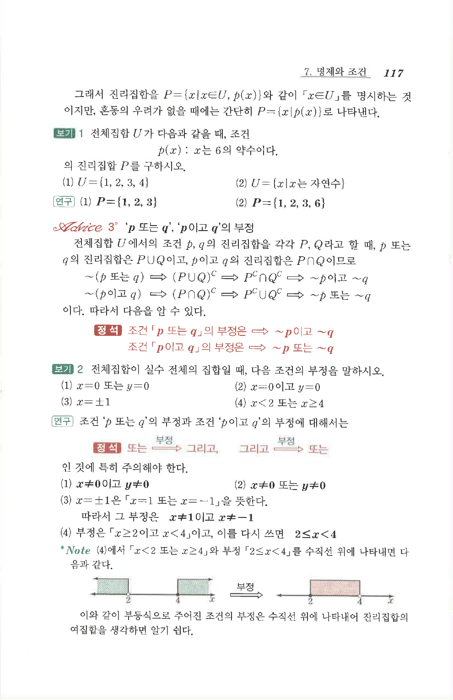

# S 보기 2

## 문제

전체집합이 실수 전체의 집합일 때, 다음 조건의 부정을 말하시오.

1. $x=0$ 또는 $y=0$
2. $x=0$이고 $y=0$
3. $x=\pm1$
4. $x<2$ 또는 $x\ge4$

## 정답

1. $x\ne0$이고 $y\ne0$
2. $x\ne0$ 또는 $y\ne0$
3. $x\ne1$이고 $x\ne-1$
4. $2\le x<4$

## 원문 문제

## 원문

