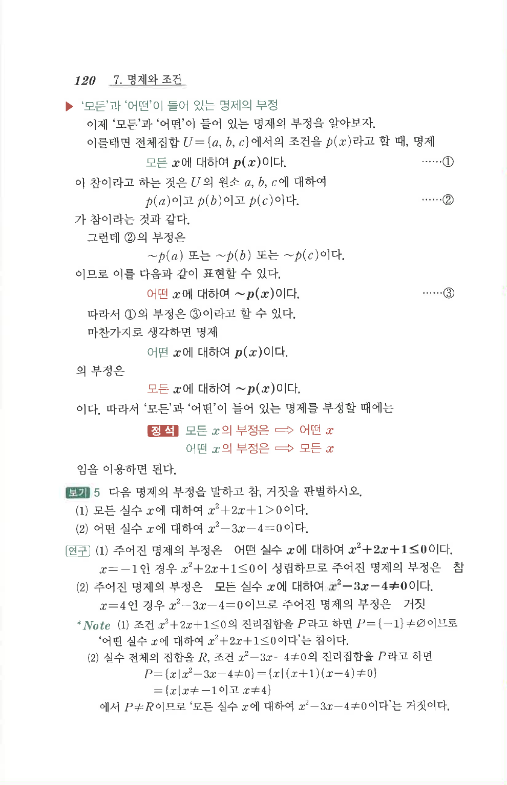

# S 보기 5

## 문제

다음 명제의 부정을 말하고 참, 거짓을 판별하시오.

1. 모든 실수 $x$에 대하여 $x^2+2x+1>0$이다.
2. 어떤 실수 $x$에 대하여 $x^2-3x-4=0$이다.

## 정답

1. 부정: 어떤 실수 $x$에 대하여 $x^2+2x+1\le0$이다. 원래 명제는 거짓이고, 부정은 참이다.
2. 부정: 모든 실수 $x$에 대하여 $x^2-3x-4\ne0$이다. 원래 명제는 참이고, 부정은 거짓이다.

## 원문 문제

## 원문

