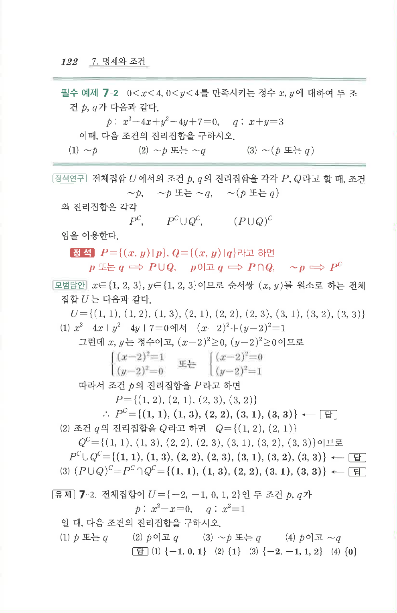

# 필수 예제 7-2

## 문제

$0<x<4$, $0<y<4$를 만족시키는 정수 $x$, $y$에 대하여 두 조건 $p$, $q$가 다음과 같다.

$p:x^2-4x+y^2-4y+7=0$, $q:x+y=3$

이때, 다음 조건의 진리집합을 구하시오.

1. $\sim p$
2. $\sim p$ 또는 $\sim q$
3. $\sim(p\text{ 또는 }q)$

## 정답

1. $\{(1,1),(1,3),(2,2),(3,1),(3,3)\}$
2. $\{(1,1),(1,3),(2,2),(2,3),(3,1),(3,2),(3,3)\}$
3. $\{(1,1),(1,3),(2,2),(3,1),(3,3)\}$

## 원문 문제

## 원문

