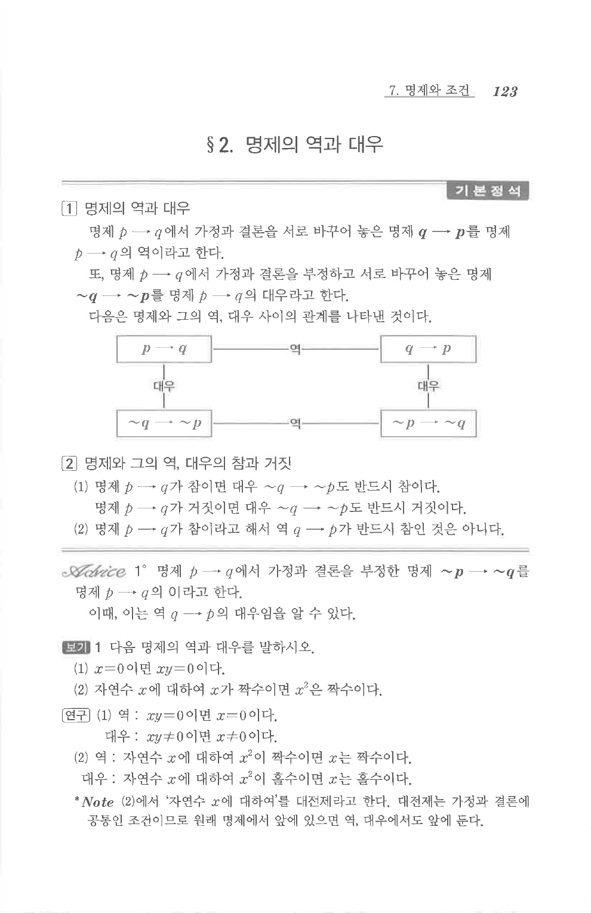

# S 보기 1

## 문제

다음 명제의 역과 대우를 말하시오.

1. $x=0$이면 $xy=0$이다.
2. 자연수 $x$에 대하여 $x$가 짝수이면 $x^2$은 짝수이다.

## 정답

1. 역: $xy=0$이면 $x=0$이다. 대우: $xy\ne0$이면 $x\ne0$이다.
2. 역: 자연수 $x$에 대하여 $x^2$이 짝수이면 $x$는 짝수이다. 대우: 자연수 $x$에 대하여 $x^2$이 홀수이면 $x$는 홀수이다.

## 원문 문제

## 원문

