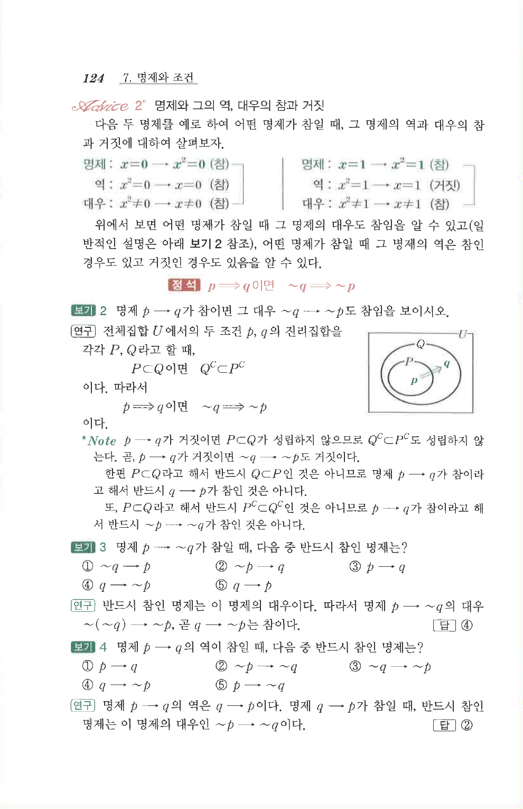

# S 보기 2

## 문제

명제 $p\to q$가 참이면 그 대우 $\sim q\to\sim p$도 참임을 보이시오.

## 정답

명제 $p\to q$가 참이면 진리집합 $P$, $Q$에 대하여 $P\subset Q$이다. 따라서 $Q^C\subset P^C$이므로 $\sim q\to\sim p$도 참이다.

## 도형

원문에는 $P$가 $Q$ 안에 포함된 벤 다이어그램이 함께 제시되어 있다.

## 원문 문제

## 원문

