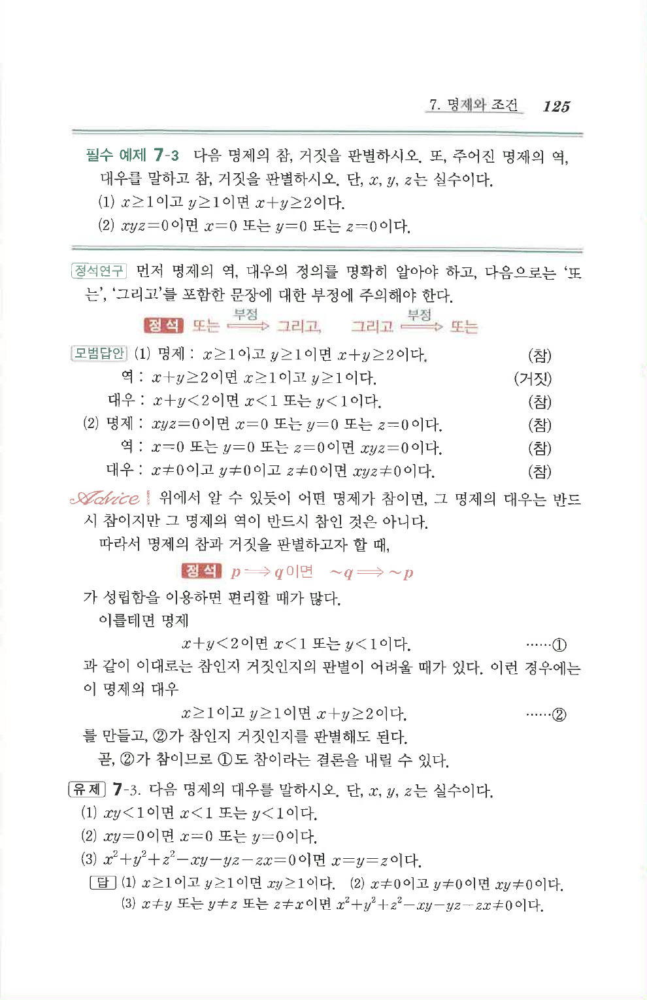

# 필수 예제 7-3

## 문제

다음 명제의 참, 거짓을 판별하시오. 또, 주어진 명제의 역, 대우를 말하고 참, 거짓을 판별하시오. 단, $x$, $y$, $z$는 실수이다.

1. $x\ge1$이고 $y\ge1$이면 $x+y\ge2$이다.
2. $xyz=0$이면 $x=0$ 또는 $y=0$ 또는 $z=0$이다.

## 정답

1. 명제는 참. 역은 「$x+y\ge2$이면 $x\ge1$이고 $y\ge1$이다.」로 거짓. 대우는 「$x+y<2$이면 $x<1$ 또는 $y<1$이다.」로 참.
2. 명제는 참. 역은 「$x=0$ 또는 $y=0$ 또는 $z=0$이면 $xyz=0$이다.」로 참. 대우는 「$x\ne0$이고 $y\ne0$이고 $z\ne0$이면 $xyz\ne0$이다.」로 참.

## 원문 문제

## 원문

