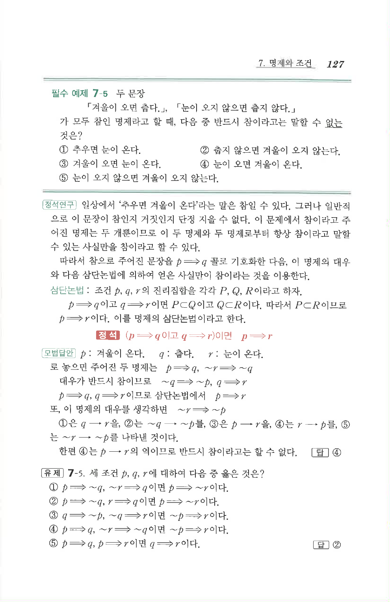

# 필수 예제 7-5

## 문제

두 문장 「겨울이 오면 춥다.」, 「눈이 오지 않으면 춥지 않다.」가 모두 참인 명제라고 할 때, 다음 중 반드시 참이라고는 말할 수 없는 것은?

① 추우면 눈이 온다.  
② 춥지 않으면 겨울이 오지 않는다.  
③ 겨울이 오면 눈이 온다.  
④ 눈이 오면 겨울이 온다.  
⑤ 눈이 오지 않으면 겨울이 오지 않는다.

## 정답

④

## 원문 문제

## 원문

