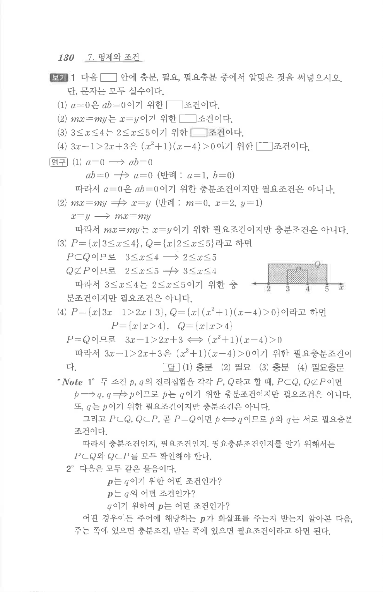

# S 보기 1

## 문제

다음 $\square$ 안에 충분, 필요, 필요충분 중에서 알맞은 것을 써넣으시오. 단, 문자는 모두 실수이다.

1. $a=0$은 $ab=0$이기 위한 $\square$ 조건이다.
2. $mx=my$는 $x=y$이기 위한 $\square$ 조건이다.
3. $3\le x\le4$는 $2\le x\le5$이기 위한 $\square$ 조건이다.
4. $3x-1>2x+3$은 $(x^2+1)(x-4)>0$이기 위한 $\square$ 조건이다.

## 정답

1. 충분
2. 필요
3. 충분
4. 필요충분

## 원문 문제

## 원문

