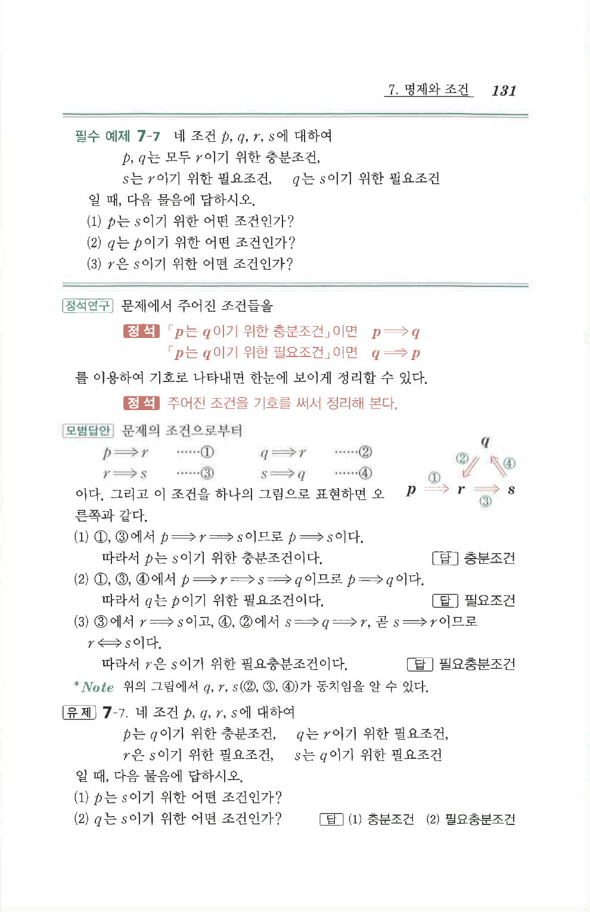

# 필수 예제 7-7

## 문제

네 조건 $p$, $q$, $r$, $s$에 대하여

$p$, $q$는 모두 $r$이기 위한 충분조건, $s$는 $r$이기 위한 필요조건, $q$는 $s$이기 위한 필요조건

일 때, 다음 물음에 답하시오.

1. $p$는 $s$이기 위한 어떤 조건인가?
2. $q$는 $p$이기 위한 어떤 조건인가?
3. $r$은 $s$이기 위한 어떤 조건인가?

## 정답

1. 충분조건
2. 필요조건
3. 필요충분조건

## 도형

원문 해설에는 $p,q,r,s$ 사이의 조건 방향을 화살표로 정리한 도식이 있다.

## 원문 문제

## 원문

