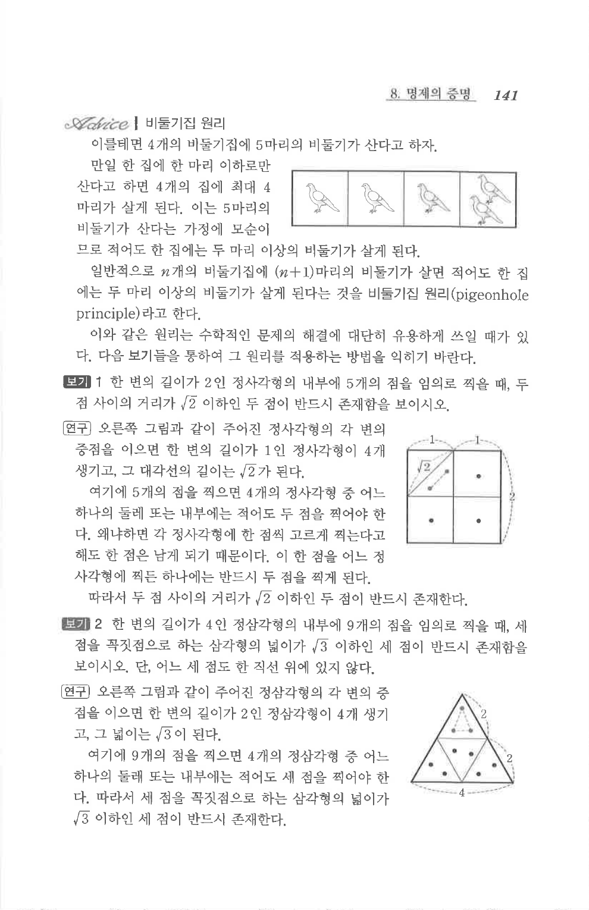

# S07 보기 2

## 문제

한 변의 길이가 $4$인 정삼각형의 내부에 $9$개의 점을 임의로 찍을 때, 세 점을 꼭짓점으로 하는 삼각형의 넓이가 $\sqrt{3}$ 이하인 세 점이 반드시 존재함을 보이시오. 단, 어느 세 점도 한 직선 위에 있지 않다.

## 도형

한 변의 길이가 $4$인 정삼각형을 한 변의 길이가 $2$인 정삼각형 $4$개로 나눈 그림이다.

## 원문 문제

## 원문

