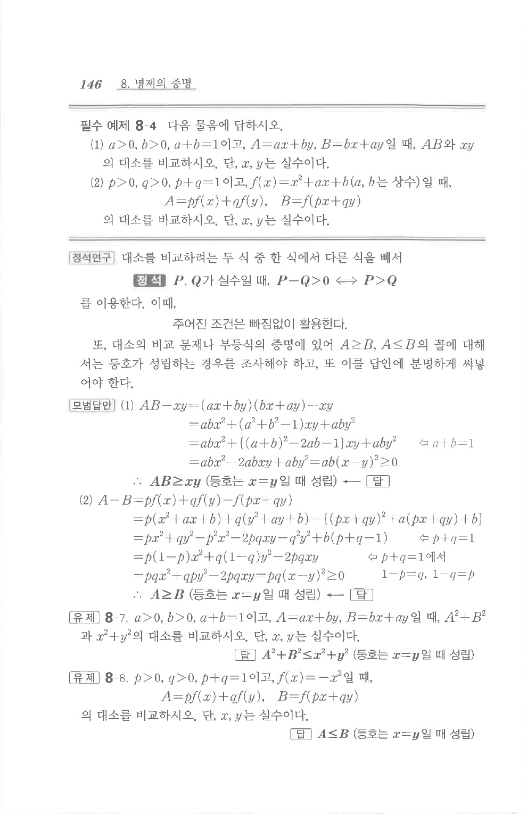

# 필수 예제 8-4

## 문제

다음 물음에 답하시오.

(1) $a>0$, $b>0$, $a+b=1$이고, $A=ax+by$, $B=bx+ay$일 때, $AB$와 $xy$의 대소를 비교하시오. 단, $x,y$는 실수이다.

(2) $p>0$, $q>0$, $p+q=1$이고, $f(x)=x^2+ax+b$ ($a,b$는 상수)일 때,

$$A=pf(x)+qf(y),\qquad B=f(px+qy)$$

의 대소를 비교하시오. 단, $x,y$는 실수이다.

## 정답

(1) $AB\ge xy$  
등호는 $x=y$일 때 성립한다.

(2) $A\ge B$  
등호는 $x=y$일 때 성립한다.

## 원문 문제

## 원문

